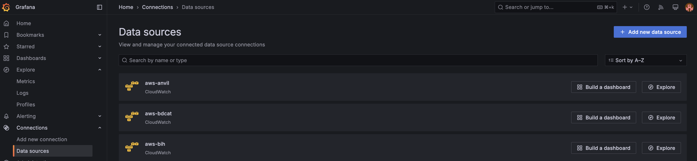
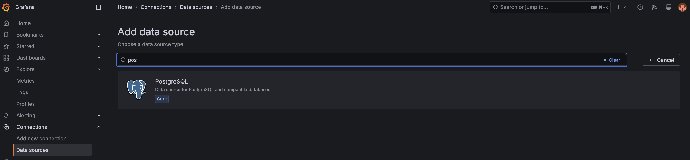
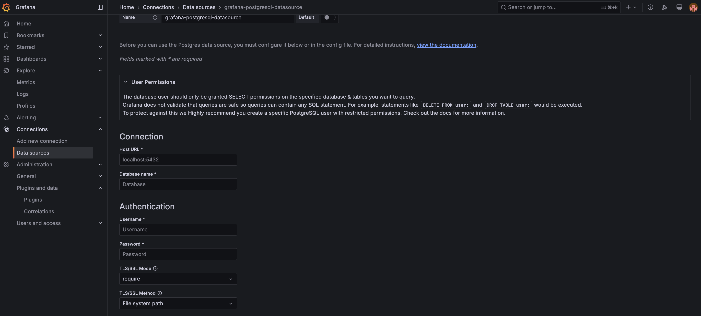
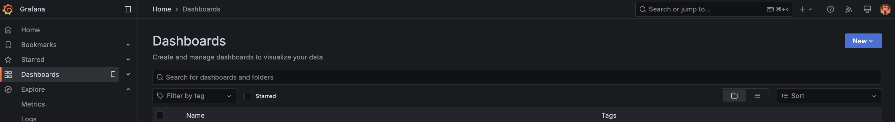
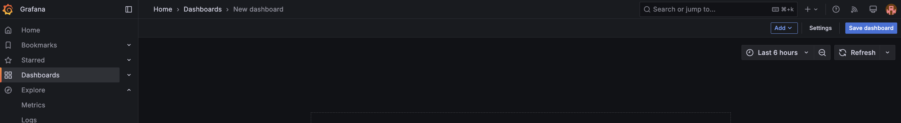
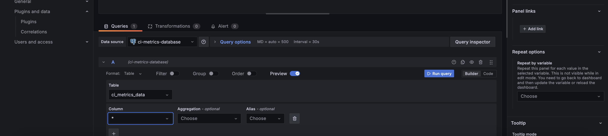
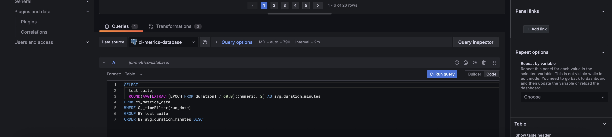
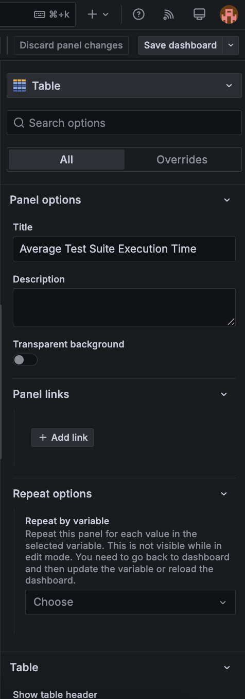
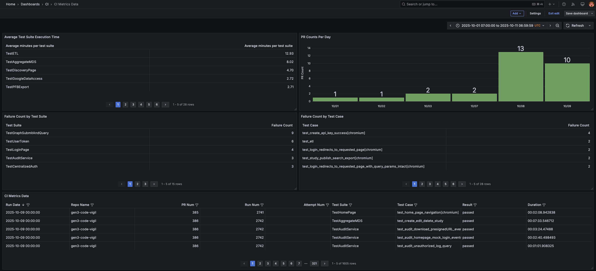

# Setting up ci-metrics schema and grafana dashboard

## Creating ci-metrics schema

1. Connect to the database
   ```psql -h <hostname> -p 5432 -U <username> -d <dbname>```
2. Create the schema
   ```
   CREATE TABLE ci_metrics_data (
       run_date     DATE NOT NULL,
       repo_name    TEXT NOT NULL,
       pr_num       INTEGER NOT NULL,
       run_num      INTEGER NOT NULL,
       test_suite   TEXT NOT NULL,
       test_case    TEXT NOT NULL,
       result       TEXT NOT NULL,
       duration     INTERVAL NOT NULL,
       attempt_num  INTEGER NOT NULL
   );
3. Add a constraint to avoid duplicates
   ```
   ALTER TABLE ci_metrics_data
   ADD CONSTRAINT unique_test_run
   UNIQUE (run_date, repo_name, pr_num, run_num, attempt_num, test_suite, test_case);


## Connecting the database in grafana
1. In Grafana, goto **Connections** -> **Data sources** page and click on **Add new data source**.

2. Search for postgresql

3. Fill in the details for the ci-metrics database


## Creating charts in Dashboard
1. In Grafana, goto **Dashboard** page and click on **New** -> **New dashboard**.

2. On the top right tab, click on **Add** button -> **Visualization**.

3. In the **Query Panel** panel, select the datasource and database.

4. Build or code your sql query to retrieve relevant data to the chart being created.

5. In the **Panel Options** panel, set the required properties pertaining to the chart.



# Queries for ci-metrics charts on Grafana
1. Average Test Suite Execution Time
    ```
    SELECT
    test_suite,
    ROUND(AVG(EXTRACT(EPOCH FROM duration) / 60.0)::numeric, 2) AS avg_duration_minutes
    FROM ci_metrics_data
    WHERE $__timeFilter(run_date)
    GROUP BY test_suite
    ORDER BY avg_duration_minutes DESC;
2. PR Counts Per Day
    ```
    SELECT
      run_date::date AS time,
      COUNT(DISTINCT pr_num) AS pr_count
    FROM ci_metrics_data
    WHERE $__timeFilter(run_date)
    GROUP BY run_date::date
    ORDER BY time;
3. Failure Count by Test Suite
    ```
    SELECT
      test_suite,
      COUNT(*) AS failure_count
    FROM ci_metrics_data
    WHERE result = 'failed' and $__timeFilter(run_date)
    GROUP BY test_suite
    ORDER BY failure_count DESC;
4. Failure Count by Test Case
    ```
    SELECT
      test_case,
      COUNT(*) AS failure_count
    FROM ci_metrics_data
    WHERE result = 'failed' and $__timeFilter(run_date)
    GROUP BY test_case
    ORDER BY failure_count DESC;
5. CI Metrics Data
    ```
    SELECT run_date,repo_name,pr_num,run_num,attempt_num,test_suite,test_case,result,duration
    FROM ci_metrics_data
    WHERE $__timeFilter(run_date)
    ORDER BY run_date DESC


