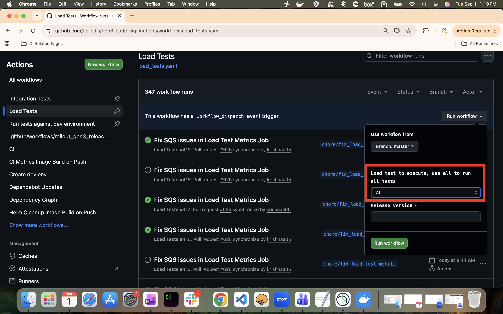

# Overview
This is the repository for managing Gen3 load tests. The code is written in Python, and the following tools/frameworks are used:

- **`poetry`** (package management [docs](https://python-poetry.org/docs/))
- **`pytest`** (testing framework [docs](https://docs.pytest.org/en/stable/))
- **`requests`** (tool for making HTTP requests [docs](https://docs.python-requests.org/en/master/))
- **`playwright`** (tool for automating web applications [docs](https://playwright.dev/python/docs/intro))
- **`gen3sdk-python`** (SDK for handling common Gen3 tasks [docs](https://github.com/uc-cdis/gen3sdk-python))
- **`xdist`** (parallel test execution [docs](https://pytest-xdist.readthedocs.io/en/stable/))
- **`allure`** (tool for visualizing test results [docs](https://allurereport.org/docs/pytest/))
- **`Grafana k6`** (tool for running load tests [docs](https://grafana.com/docs/k6/latest/))

# Running tests

## Setup

### Set up prerequisites

#### Checkout and switch directory
Checkout this repo and switch to `gen3-load-tests` directory. This is the root directory for load tests.

#### Create `~/.gen3` directory
The load tests look for API keys in this location. Make sure you created this directory.

#### Create `.env` file
Switch to `gen3-load-tests` directory and create a `.env` file. The code is designed to fetch environment variables set in this file.
The following are some environment variables to set:
```
HOSTNAME=<your namespace>.planx-pla.net
NAMESPACE=<namespace>
HOSTNAME_PROTOCOL=https/http
```

#### Create output and install dependencies
*The output directory is used to store the markdown report that is also generated along with the allure report.*

Switch to `gen3-code-vigil/gen3-load-tests` and run the commands:
```
mkdir output
poetry install
```

### Set up test users
The code supports running test steps as different users. This [code](conftest.py#L19-L37) can provide insights into the set up process.

The test users required to run the tests are listed [here](test_data/test_setup/users.csv).

The API keys for these users must be saved to `~/.gen3` directory before running tests.[here](docs/howto/generate_api_keys_for_test_users/)

### Set up test user permissions
User permissions required for the tests to pass are documented [here](test_data/test_setup/user.yaml). The tests attempt to run usersync before starting, so if usersync is correctly set up with this configuration there is nothing more to do. If that is not the case please make sure to run usersync or useryaml with this configuration before running the tests.

## Run tests and review results
Read these [docs](docs/howto/run_tests.md) for specific information on how to run tests.

The report can be viewed by running `allure serve allure-results`

By default ALL tests are run. In-order to run specific test, user can select it from the workflow dispatch dropdown menu. 

# Writing tests

## Design principles
- The test suites must be independent and idempotent.
- All tests should be able to run anywhere (locally / CI) without changing test code.
- Debugging must be done locally, not in CI pipeline.
- Documentation is essential. Code is incomplete without it.
- Avoid hard waits. Test should wait for application state, not otherwise.
- Add test steps as docstrings in the test for understanding the purpose of the test easily.
- Ensure that privileged information is not logged since the tests run in Github Actions and the logs are public.

## Code structure
The test code is organized into several directories for ease of maintenance:

- **`load_testing_scripts`**: Contains js files for the tests to be run on k6
- **`tests`**: Contains tests written in pytest
- **`test_data`**: Contains test data needed for load tests.
- **`services`**: Contains endpoints and methods specific to each service, with a separate module for each service.
- **`utils`**: Provides utility and helper functions used across tests.
- **`scripts`**: Includes standalone helper scripts used for setting up the test environment.

[conftest.py](./conftest.py) controls the test flow.

Code used for running load tests in CI at CTDS is at `gen3-code-vigil/gen3-load-tests/gen3_ci`.
- **`scripts`** directory contains python scripts used in the github actions workflow.

Tests are organized into test suites using classes as explained [here](https://docs.pytest.org/en/stable/getting-started.html#group-multiple-tests-in-a-class).
